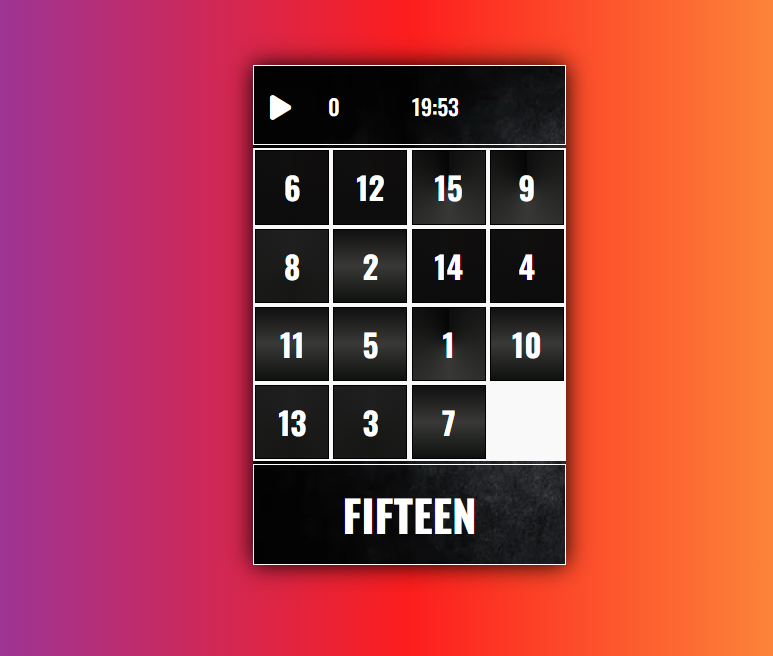
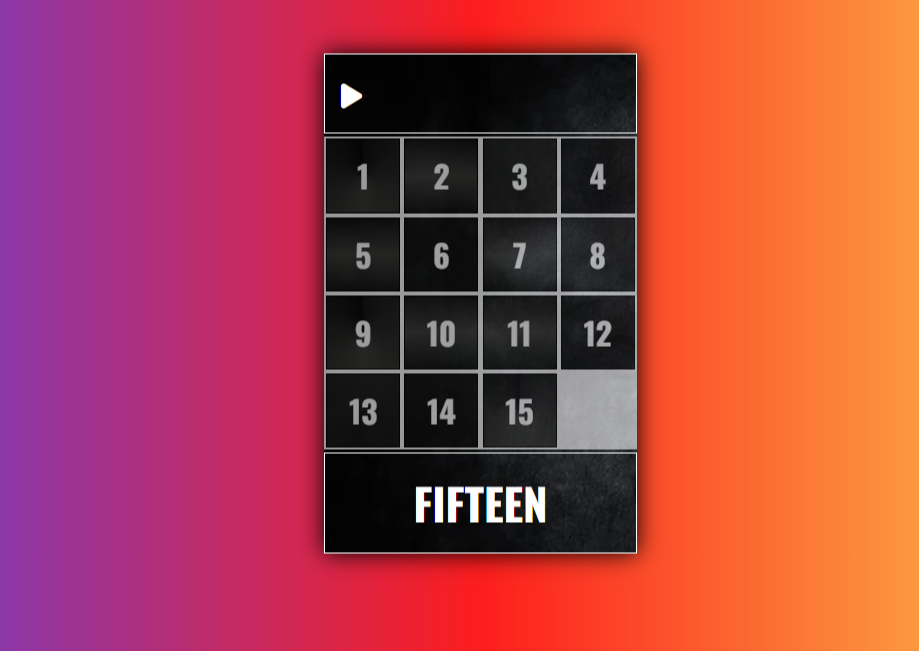
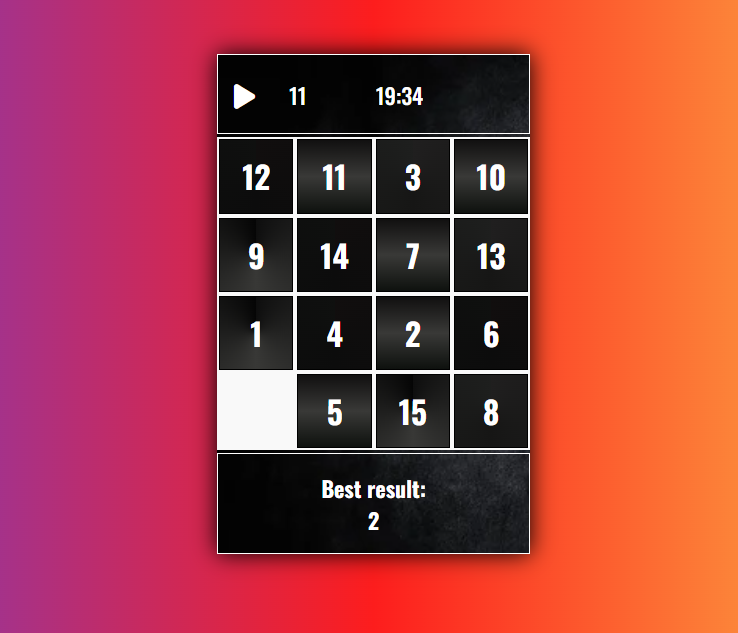

# Fifteen Puzzle Game

Welcome to the Fifteen Puzzle game, a challenging yet fun test of your problem-solving abilities, implemented using pure vanilla JS! This project is an exercise in problem-solving and programming without relying on external libraries, frameworks or ChatGPT, only documentation was used during the development process.

## Gameplay

In the Fifteen Puzzle game, your task is to re-arrange the scrambled tiles in a specific pattern. You'll have 20 minutes to do this. The game has an integrated timer that counts down from 20 minutes to 00:00.

The user's number of moves are counted and recorded throughout the gameplay. If you manage to arrange all the puzzle tiles before the timer counts down to 00:00, you win! However, if the tiles remain unordered when the time runs out, you lose. Challenge yourself and try to solve the puzzle

## Features

- The game includes auditory feedback through sounds, providing a more immersive gameplay experience.
- It uses local storage to save your results, so you can always come back and try to beat your best score.

## Coding

This game is developed using pure vanilla JavaScript. With this app I have aimed to develop my problem-solving skills without the use of any libraries or frameworks, haven't been addressing systems like ChatGPT while coding. Everything in this game, from the game logic to the UI, is hand-coded with JS and based on documentation.
